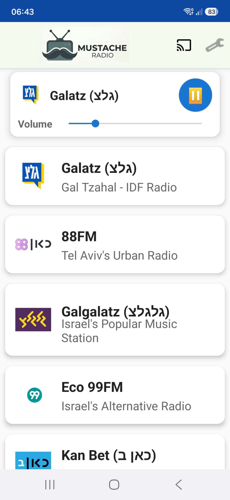
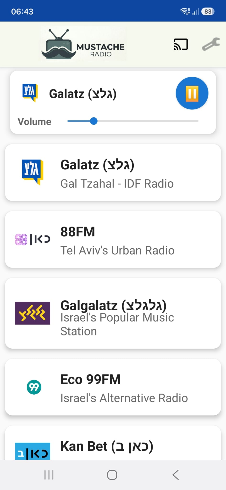

# Mustache Radio

Personal Israeli radio streaming app for Android.

## Screenshots

| Light | Dark |
|-------|------|
|  |  |

## Features

- **8 stations**: Galatz, Galgalatz, 100FM, Eco 99FM, 88FM, Kan Bet, 103FM, 102FM
- **Last-played sorting** — most recently played station floats to the top
- **Android Auto** — list and grid views with steering-wheel skip controls
- **Google Cast** — stream to any Google Cast device or speaker group; volume buttons routed to Cast device when casting
- **Pre-roll bypass** — 88FM and Kan Bet (StreamTheWorld) warm up silently on startup so the user never hears the ad
- **Dark mode** toggle in Settings

## Requirements

- Android 7.0+ (API 24)
- Android Studio or the Gradle wrapper to build
- ADB for sideloading

## Build

```bash
./gradlew assembleDebug
```

Install on a connected device:

```bash
adb install -r app/build/outputs/apk/debug/MustacheRadio-v<version>.apk
```

Or build + install in one step:

```bash
./gradlew installDebug
```

## Architecture

| File | Purpose |
|------|---------|
| `Stations.kt` | Single source of truth for the station catalogue |
| `RadioPlaybackService.kt` | `MediaBrowserServiceCompat` — playback, Android Auto, Cast routing |
| `PrerollWarmer.kt` | Silent warm-up player for StreamTheWorld stations |
| `MainActivity.kt` | UI — station list, play/pause, volume, Cast button |
| `PlayHistoryManager.kt` | Persists last-played timestamps for sorting |
| `CastOptionsProvider.kt` | Google Cast framework configuration |
| `MustacheRadioApplication.kt` | Initialises `CastContext` on app start |

## Casting

The app uses the **Default Media Receiver** (`CC1AD845`) — no custom Cast app needed. It works with every Chromecast and Google Home speaker/group on the local network.

When a Cast session is active:
- Volume slider and hardware volume keys control the **Cast device** volume
- Play/pause routes through `remoteMediaClient` instead of ExoPlayer
- Disconnecting Cast resumes local playback automatically

## Stations

| ID | Name | CDN |
|----|------|-----|
| `galatz` | Galatz (גלצ) | bynetcdn.com |
| `galgalatz` | Galgalatz (גלגלצ) | bynetcdn.com |
| `radius100fm` | Radius 100FM | cybercdn.live |
| `eco99fm` | Eco 99FM | livecdn.biz |
| `88fm` | 88FM | streamtheworld.com |
| `kanbet` | Kan Bet (כאן ב) | streamtheworld.com |
| `103fm` | 103FM | cybercdn.live |
| `102fm` | 102FM - Radio Tel Aviv | livecdn.biz |
